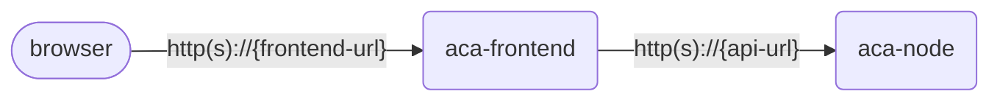

# Azure Container Apps CLI research study

## App overview

You'll be working with the app in this repository. It consists of two projects.

- `aca-frontend` - A Node.js app that serves the web frontend UI for a music store. It calls a web API to retrieve albums data.
- `aca-node` - The web API that serves album data at `/albums`.

There are other projects in the repository that implement the same albums API in other languages.

## Container images

For this study, you won't be working directly with the code; we've created Docker images for both the frontend and web API apps.

These images are in a public repository and do not require authentication.

- `albums.azurecr.io/aca-frontend:1.0` – the frontend app
    * Exposed port: 3000
    * Environment variables:
        * `API_BASE_URL` - This variable must be set to the base URL of the backend API (e.g., `https://backend.my-app.com`).
- `albums.azurecr.io/aca-node:1.0` – the backend web API
    * Exposed port: 3000
